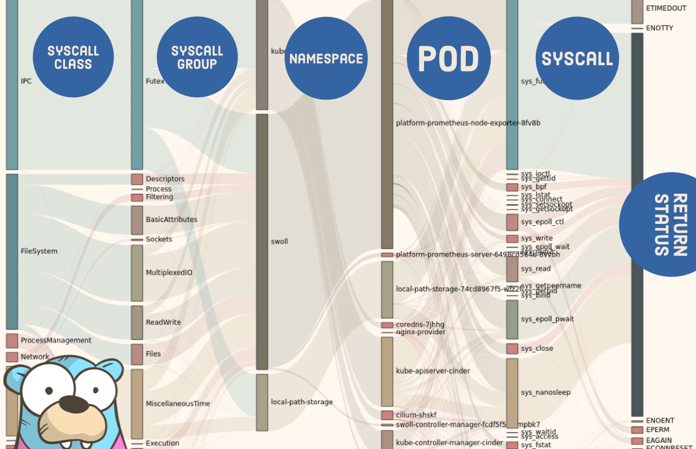

[](https://drone.cstack.co/criticalstack/swoll)

<p align="center">
  
</p>

# Introduction

Swoll is an experimental suite of applications and APIs for monitoring kernel-level activity on a live Kubernetes cluster, mostly written in the Golang programming language, strewn about with bits and bobs of C and Yaml. 

Using simple counters and a minimal state, Swoll can report on a wide bevy of information on system calls being made by or from a container running inside a Kubernetes cluster. Each metric for both timing and counting contains the following information:

* Syscall
  - Return Status
  - Classification
  - Group
* Kubernetes information
  - Namespace
  - Pod
  - Container

Aggregating data in this manner allows a user to monitor every call and its resulting return status for every container in every Kubernetes Pod. For example, one can query the total count of calls to the function `sys_openat` sourced from a specific container in the pod `coredns` in the namespace `kube-system` that resulted in a "No such file or directory" error.

Metrics are exposed via the URI `/metrics` in `Prometheus` format, along with detailed charting examples (powered by e-charts) at the URI `/metrics/charts`.

**Example charts output**

_The above Sankey diagram displays the distribution of system calls in an attractive™ manner._

**Prometheus query examples** 
```sh
$ promtool query instant https://prometheus.local '
  sort_desc(
   sum(
    swoll_node_metrics_syscall_count{
     namespace="kube-system"
    }) by (err))'

{err="ETIMEDOUT"}       => 745430
{err="EAGAIN"}          => 254506
{err="EINPROGRESS"}     => 2217
{err="EPERM"}           => 1779
{err="ENOENT"}          => 1288
{err="EPROTONOSUPPORT"} => 60
{err="EINTR"}           => 46
```
_Total count of syscalls grouped by the return-status originating from the Kubernetes namespace `kube-system`_

```sh
$ promtool query instant https://prometheus.local '
  sort_desc(
   sum(
    swoll_node_metrics_syscall_count{
     namespace="kube-system",
     syscall="sys_openat"
    }) by (namespace,pod))'

{namespace="kube-system", pod="kube-proxy-27xrc"}                 => 1260
{namespace="kube-system", pod="cilium-shskf"}                     => 670
{namespace="kube-system", pod="kube-apiserver-cinder"}            => 471
{namespace="kube-system", pod="coredns-7jhhg"}                    => 297
{namespace="kube-system", pod="kube-controller-manager-cinder"}   => 191
{namespace="kube-system", pod="cilium-operator-657978fb5b-cjx72"} => 78
```
_Count all calls to the function `sys_openat` grouped by Kubernetes Pod, and namespace_

```sh
$ promtool query instant https://prometheus.local '
  sort_desc(
   avg by (container, pod, namespace, syscall) (
    rate(
     swoll_node_metrics_syscall_count { err != "OK" }[5m]
     offset 5m
    )) /
   avg by (container, pod, namespace, syscall) (
    rate(
     swoll_node_metrics_syscall_count{ err != "OK" }[5m]
    )
   ))'
{container="operator", namespace="kube-system", pod="cilium-operator", syscall="sys_epoll_ctl"} => 2.0
{container="coredns",  namespace="kube-system", pod="coredns-7jhhg",   syscall="sys_futex"}     => 1.1
{container="operator", namespace="kube-system", pod="cilium-operator", syscall="sys_read"}      => 1.0
{container="agent",    namespace="kube-system", pod="cilium-shskf",    syscall="sys_futex"}     => 1.0
```
_Query the relative change in the rate of calls that incurred an error compared to the previous 5 minutes grouped by container, Pod, namespace, and syscall_ 

---

While metrics by themselves are great and all, `swoll` also provides a
Kubernetes-native interface for creating, collecting, and presenting detailed
real-time logs of system activity. 

Take the following Trace configuration as an example:

```yaml
apiVersion: tools.swoll.criticalstack.com/v1alpha1
kind: Trace
metadata:
  name: trace-nginx-hosts
  namespace: swoll
spec:
  syscalls:
    - connect
    - accept4
    - bind
    - listen
    - execve
    - openat
  labelSelector:
      matchLabels:
          app: "nginx"
  fieldSelector:
      matchLabels:
          status.phase: "Running"
```

When applied, `swoll` will start tracing the system-calls `connect`, `accept4`, `bind`, `listen`, `execve`, and `openat` for any containers that match the pod-label `app=nginx`, and the field-label `status.phase=Running` (match only running containers). 

Once started, the raw JSON events are retrieved via `kubectl logs`:

```sh
$ kubectl logs -l sw-job=trace-nginx-hosts -n swoll | head -n 1 | jq .
```

```json
{
  "payload": {
    "syscall": {
      "nr": 257,
      "name": "sys_openat",
      "class": "FileSystem",
      "group": "Files"
    },
    "pid": 3797092,
    "tid": 3797092,
    "uid": 0,
    "gid": 0,
    "comm": "sh",
    "session": 1,
    "container": {
      "id": "13765a70dfbb1b35ebff60c04ddfebf9177715bcf79e67279d4e8128799501bf",
      "pod": "nginx-provider",
      "name": "indexwriter",
      "image": "sha256:1510e850178318cd2b654439b56266e7b6cbff36f95f343f662c708cd51d0610",
      "namespace": "swoll",
      "labels": {
        "io.kubernetes.container.name": "indexwriter",
        "io.kubernetes.pod.name": "nginx-provider",
        "io.kubernetes.pod.namespace": "swoll",
        "io.kubernetes.pod.uid": "4c16fc49-2c47-427d-b5d6-a222e65b76c9"
      },
      "pid": 408510,
      "pid-namespace": 4026535150
    },
    "error": "OK",
    "return": 3,
    "pid_ns": 4026535150,
    "uts_ns": 4026535144,
    "mount_ns": 4026535149,
    "start": 529490506498247,
    "finish": 529490506535997,
    "args": {
      "dir_fd": -100,
      "pathname": "/html/index․html",
      "flags": [
        "O_CREAT",
        "O_APPEND",
        "O_WRONLY"
      ]
    }
  }
}
```


_A sweet gif showing a trace running... So 2020_


---

## Using the API to trace.

### Local, without Kubernetes resolution

In this example, we display how to utilize the `swoll` Golang API to initiate a local trace of the `execve` call without Kubernetes locally.

```go
package main

import (
    "bytes"
    "context"
    "fmt"
    "io/ioutil"

    "github.com/criticalstack/swoll/pkg/event"
    "github.com/criticalstack/swoll/pkg/event/call"
    "github.com/criticalstack/swoll/pkg/event/reader"
    "github.com/criticalstack/swoll/pkg/kernel"
    "github.com/criticalstack/swoll/pkg/kernel/filter"
)

func main() {
    // read local bpf object
    bpf, _ := ioutil.ReadFile("internal/bpf/probe.o")
    // create a probe object
    probe, _ := kernel.NewProbe(bytes.NewReader(bpf), nil)

    // initialize the underlying bpf tables
    probe.InitProbe()

    // create a new kernel-filter bound to the current bpf probe
    filt, _ := filter.NewFilter(probe.Module())
    // inform the probe we are interested in all execve
    filt.AddSyscall("execve", -1)

    // create an event reader for the probe
    reader := reader.NewEventReader(probe)
    // run the probe
    go reader.Run(context.Background())

    // where to store decoded events
    decoded := new(event.TraceEvent)

    for {
        // read a single message from the event queue from the kernel
        msg := <-reader.Read()
        // convert the raw data from the kernel into a proper TraceEvent object
        decoded.Ingest(msg)

        // fetch the arguments associated with the call
        args := decoded.Argv.(call.Function).Arguments()

        fmt.Printf("comm:%-15s pid:%-8d %s(%s)\n", decoded.Comm, decoded.Pid, decoded.Syscall, args)
    }
}
```

### Local, With Kubernetes

The easiest way to trace Kubernetes is to utilize the `Topology` API, which consists of an `Observer` and a `Hub`. A `Hub` is an abstraction around kernel filtering based on events sourced from the `Observer`. In this case, we will utilize a Kubernetes `Observer` which emits container-ready events for any POD events.

```go
package main

import (
    "context"
    "fmt"
    "io/ioutil"
    "os"
    "path/filepath"

    "github.com/criticalstack/swoll/api/v1alpha1"
    "github.com/criticalstack/swoll/internal/pkg/hub"
    "github.com/criticalstack/swoll/pkg/event"
    "github.com/criticalstack/swoll/pkg/event/call"
    "github.com/criticalstack/swoll/pkg/topology"
)

func main() {
    // read local bpf object
    bpf, _ := ioutil.ReadFile("internal/bpf/probe.o")
    kConfig := os.Getenv("HOME") + "/.kube/config"
    rootDir := "/proc/3796667/root"
    criSock := "/run/containerd/containerd.sock"

    // create a kubernetes observer
    kTopo, _ := topology.NewKubernetes(
        topology.WithKubernetesCRI(filepath.Join(rootDir, criSock)),
        topology.WithKubernetesConfig(kConfig),
        topology.WithKubernetesProcRoot(rootDir))

    // initialize an event hub and bind it to the kubernetes observer
    kHub, _ := hub.NewHub(&hub.Config{
        AltRoot:     rootDir,
        BPFObject:   bpf,
        CRIEndpoint: filepath.Join(rootDir, criSock),
        K8SEndpoint: kConfig}, kTopo)

    // run the event hub
    go kHub.Run(context.Background())

    // create a trace specification to monitor execve on all pods
    trace := &v1alpha1.Trace{
        Spec: v1alpha1.TraceSpec{
            Syscalls: []string{"execve"},
        },
        Status: v1alpha1.TraceStatus{
            JobID: "trace-nginx",
        },
    }

    // run the trace specification on the hub
    go kHub.RunTrace(trace)

    // attach to the running trace and print out stuff
    kHub.AttachTrace(trace, func(id string, ev *event.TraceEvent) {
        args := ev.Argv.(call.Function).Arguments()

        fmt.Printf("container=%s pod=%s namespace=%s comm:%-15s pid:%-8d %s(%s)\n",
            ev.Container.Name, ev.Container.Pod, ev.Container.Namespace,
            ev.Comm, ev.Pid, ev.Syscall, args)
    })

    select {}

}
```

This is pretty much the same as running:

```sh
swoll trace \
    --kubeconfig ~/.kube/config                                  \
    --altroot  /proc/3796667/root                                \
    --cri      /proc/3796667/root/run/containerd/containerd.sock \
    --syscalls execve
```


### Remote using the Client API

```go
package main

import (
	"context"
	"fmt"
	"log"
	"os"
	"os/signal"
	"sync"
	"syscall"

	"github.com/criticalstack/swoll/api/v1alpha1"
	"github.com/criticalstack/swoll/pkg/client"
)

func main() {
	// create the trace specification
	spec := &v1alpha1.TraceSpec{
		Syscalls: []string{"execve"},
	}

	// connect to a probe running on 172.19.0.3:9095 with SSL disabled
	ep := client.NewEndpoint("172.19.0.3", 9095, false)
	ctx := context.Background()
	// channel where events are written to
	outch := make(chan *client.StreamMessage)
	// stop all stuff channel
	stpch := make(chan bool)
	// signal channel
	sigch := make(chan os.Signal, 1)
	signal.Notify(sigch, os.Interrupt, syscall.SIGTERM)

	// create a trace with the name of "trace-stuff" inside the namespace
	// "kube-system"
	tr, err := ep.CreateTrace(ctx, "trace-stuff", "kube-system", spec)
	if err != nil {
		log.Fatal(err)
	}

	var wg sync.WaitGroup

	go func() {
		wg.Add(1)
        // Blocking reader 
		ep.ReadTraceJob(ctx, tr.Status.JobID, outch, stpch)
        // If ReadTraceJob returns, let's just delete this current job from the
        // server
		ep.DeleteTraceJob(ctx, tr.Status.JobID)
		wg.Done()
	}()

Loop:
	for {
		select {
		case ev := <-outch:
			fmt.Println(ev)
		case <-sigch:
			break Loop
		}
	}

    // notify ReadTraceJob to halt.
	stpch <- true
    // wait for the job to be deleted
	wg.Wait()
}
```

## swoll-trace
## swoll-server
## swoll-controller
## swoll-client

*Monitor. Consume. React.*

* Kernel
  - filtering
  - collection
  - distribution
  - metrics
* Userland
  - collection
  - translation
  - presentation


# Building

See [BUILD INSTRUCTIONS](BUILDING.md)


## Contributing
Any contributors must accept and [sign the CLA](https://cla-assistant.io/criticalstack/swoll).
This project has adopted the [Capital One Open Source Code of conduct](https://developer.capitalone.com/resources/code-of-conduct).
